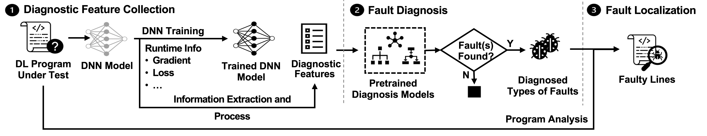
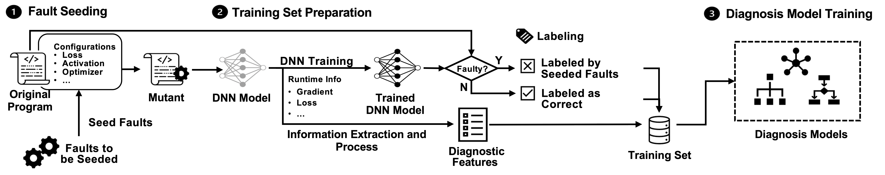

# DeepFD

DeepFD, a **learning-based** fault diagnosis and localization framework which **maps the fault localization task to a learning problem**. 

In particular, it infers the **suspicious fault types** via monitoring the runtime features extracted during DNN model training, and then locates the diagnosed faults in DL programs.


## Workflow of DeepFD




### Step 1: Diagnostic Feature Extraction

Given a program, DeepFD constructs a DNN architecture and collects runtime data such as the loss and neurons' information by training the architecture. 


### Step 2: Fault Diagnosis

After obtaining the diagnostic features, we then **infer the possible types of faults** that exist in the DL program according to the features. We regard it as a **multi-label classification problem**, which maps the obtained features into one or more possible labels.  Each label corresponds to a fault type. 

The classification relies on the predictions made by a set of **pre-trained diagnosis models** (see below). The diagnosis result is given by the union of the diagnosed faults predicted by each diagnosis model to maximize the number of faults diagnosed.


### Step 3: Fault Localization

After acquiring the diagnosed types of faults, DeepFD performs fault localization at the program level. Specifically, the program is first parsed into its abstract syntax tree (AST), and DeepFD goes through the nodes of the parse tree, traverses assignment statement as well as expressions, and then identifies the places (i.e. lines) where the diagnosed types of faults are defined. 


## Diagnosis Model Construction



### Step 1: Fault Seeding. 

This step is to prepare sufficient training samples for the diagnosis models.


### Step 2: Training Set Preparation

This step prepares the labels and extracting inputs for the training set.


### Step 3: Diagnosis Model Training

We treat the fault diagnosis as a multi-label classification problem mapping a faulty program to the multiple types of faults that it contains. We construct three diagnosis models using the three widely-used and effective machine learning algorithms (i.e., K-Nearest Neighbors, Decision Tree and Random Forest ) to learn the correlations between diagnostic features and types of faults.


## Quick Start

### Prerequisite

- Python 3.6 +

```shell
pip install -r requirements.txt
```


### Fault Diagnosis and Localization

```shell
python predict.py
```


### Fault Seeding


## Project Structure


